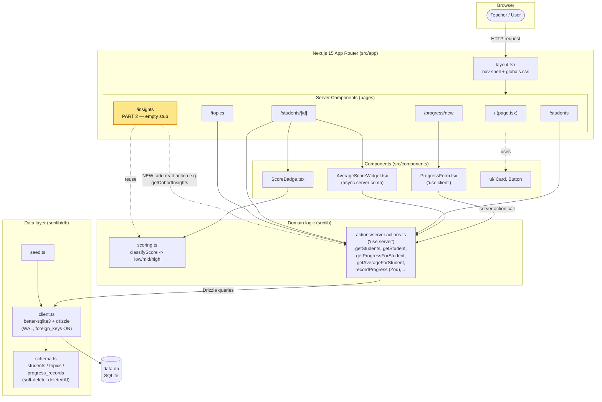
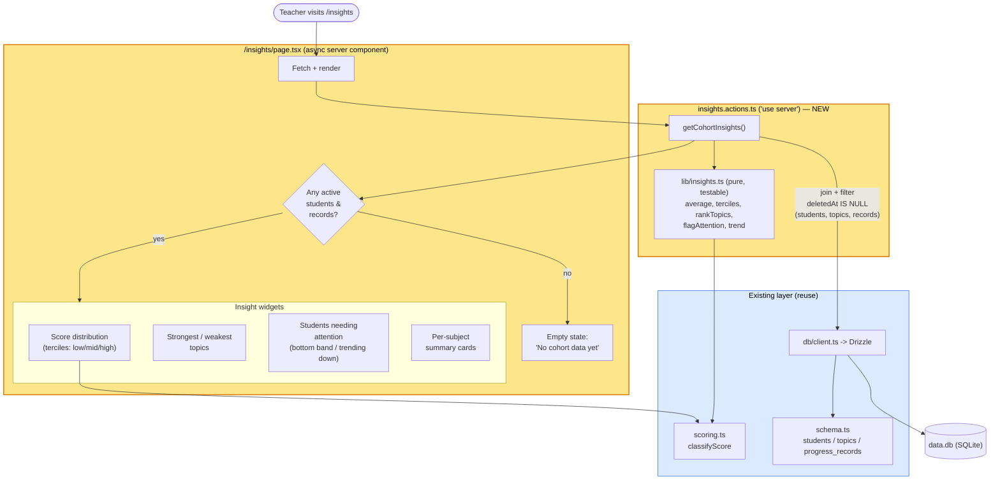

# Architecture

A Next.js 15 (App Router) app with a thin server-action layer over Drizzle/SQLite.
There are no API routes and no client-side data fetching — every route is an async
server component that reads through `src/lib/actions/server.actions.ts`.

## Overall architecture

### Layer by layer

- **Routing/render**: `src/app/layout.tsx` is the shared shell (top nav + `globals.css`).
  Each route is an async server component that awaits data directly — no client fetching
  or API layer.
- **Data access**: All reads/writes go through `server.actions.ts` (`"use server"`).
  These call Drizzle via the singleton `db` in `client.ts`, which wraps a single
  `better-sqlite3` connection to `data.db`. Mutations use `revalidatePath`.
- **Schema/conventions**: `schema.ts` defines `students`, `topics`, `progress_records`,
  all with a `deletedAt` soft-delete column. Existing queries filter on
  `isNull(deletedAt)`. Writes validate input with Zod (`recordProgressSchema`).
- **Presentation logic**: `scoring.ts` holds the `classifyScore` banding
  (low <50, mid 50-69, high >=70), consumed by `ScoreBadge`.

## Part 2 — `/insights` feature plan

### Key decisions

- **New, focused action file** (`insights.actions.ts`) rather than bloating
  `server.actions.ts` — matches the "keep files focused" convention.
- **Pure logic in `lib/insights.ts`** (averages, terciles, topic ranking,
  attention-flagging, trend detection) so it can be unit-tested without a DB.
- **Reuse `classifyScore`** so cohort terciles match the banding used elsewhere.
- **Filter `deletedAt IS NULL` on all three tables** in the join — avoiding the gap
  in the existing `getAverageForStudent` (which ignores deleted topics).
- **Explicit empty / small-sample branch** before rendering widgets.
